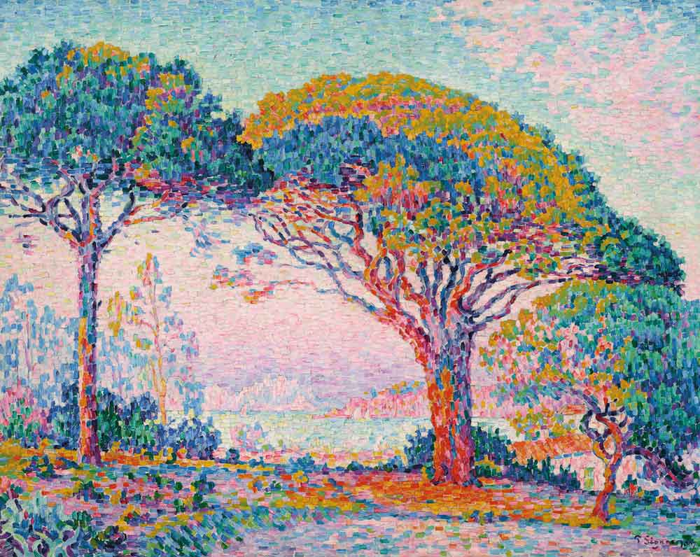

# week8Quiz

# Week 8 Quiz

## Part 1 - Imaging Technique Inspiration

I intend to extend the ‘Wheels of Fortune’ artwork by Pacita Abad for the creative coding major project by incorporating animation. I find the pointillism imaging technique particularly suitable, especially La Baie (Saint-Tropez) by Paul Signac. His use of unblended strokes to illustrate the scenery creates a blurred effect from afar which can be further manipulated to reach the goal of animating the artwork. I intend to use this technique by illustrating larger shapes using small dots and creating motion by changing the colour of the dots and shifting it’s position. 



## Part 2 - Coding Technique Exploration

Object-oriented programming (OOP), particularly the Decorator Pattern, would be ideal for implementing the animation of pointillism. OOP relies on the concept of class and objects. [Decorator Pattern](https://dev.to/alexmercedcoder/oop-design-patterns-in-javascript-3i98#decorator-pattern-in-javascript) is a type of structural design pattern in OOP that allows you to add new properties to an existing object (dots) without changing its structure. This is useful in facilitating the [animation](https://medium.com/@shiny.shubham/unlocking-the-power-of-the-decorator-pattern-f25594bc9ed5#:~:text=Other%20Common%20Use%20Cases%3A) effect as it gives the flexibility to implement dots in different positions, sizes, and colours. It also promotes reusability which can enable the layering of more complex animation effects. The code example below outlines the logic of the Decorator Pattern, demonstrating its opportunity to facilitate animation.

### Decorator Pattern Code Example 

```
class Coffee {
  cost() {
    return 5; // Base cost of a regular coffee
  }
}
Now, you want to add decorators to your coffee to customize it with additional options, such as milk and sugar:

javascript
Copy code
class MilkDecorator {
  constructor(coffee) {
    this.coffee = coffee;
  }

  cost() {
    return this.coffee.cost() + 2; // Adding the cost of milk
  }
}

class SugarDecorator {
  constructor(coffee) {
    this.coffee = coffee;
  }

  cost() {
    return this.coffee.cost() + 1; // Adding the cost of sugar
  }
}

const regularCoffee = new Coffee();
const coffeeWithMilk = new MilkDecorator(regularCoffee);
const coffeeWithMilkAndSugar = new SugarDecorator(coffeeWithMilk);

console.log(regularCoffee.cost()); // Output: 5
console.log(coffeeWithMilk.cost()); // Output: 7
console.log(coffeeWithMilkAndSugar.cost()); // Output: 8
```

## References

Berry, E. (2023, August 24). Pointillism and its Legacy: 8 Examples of this Maximalist Technique. TheCollector. https://www.thecollector.com/what-is-pointillism/ 

Gillis, A. S., & Lewis, S. (2024, June 14). object-oriented programming (OOP). App Architecture. https://www.techtarget.com/searchapparchitecture/definition/object-oriented-programming-OOP 

Merced, A. (2023, November 26). OOP design patterns in Javascript. DEV Community. https://dev.to/alexmercedcoder/oop-design-patterns-in-javascript-3i98#decorator-pattern-in-javascript 

Shubham. (2023, June 14). Introduction to the Decorator Design Pattern | Medium. Medium. https://medium.com/@shiny.shubham/unlocking-the-power-of-the-decorator-pattern-f25594bc9ed5#:~:text=Other%20Common%20Use%20Cases%3A


